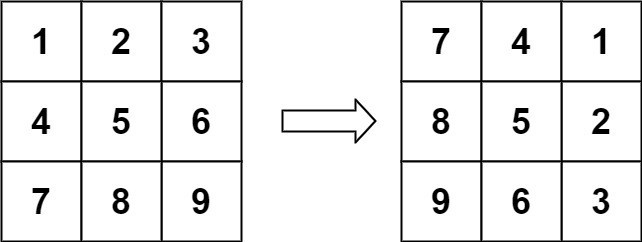

# Задача 3

### Формулировка:

Дана матрица N x N, представляющая собой изображение, необходимо повернуть изображение на 90 градусов по часовой стрелке. Изображение должно быть повернуто in-place, то есть без выделения дополнительной матрицы. 



Пример 1:  
```
Вход: matrix = [[1,2,3],[4,5,6],[7,8,9]] 
Ответ: [[7,4,1],[8,5,2],[9,6,3]] 
```
 

Пример 2: 
```
Вход: matrix = [[1,2],[3,4]] 
Ответ: [[3,1],[4,2]] 
```
 

Пример 3: 
```
Вход: matrix = [[1]] 
Ответ: [[1]] 
```

### Ограничения: 

Если длина и ширина матрицы равна n, то 

```
1 <= n <= 20 
-1000 <= matrix[i][j] <= 1000 
```

### Требования:

В поле с ответом требуется написать решение в методе `rotate` в виде, представленном ниже:

```
class Solution { 
public: 
    void rotate(vector< vector<int> > &matrix) { 

        // решение вашей задачи

    } 

}; 
```

*Комментарий*: Будьте внимательней, ваше решение будет проверяться автоматически.
